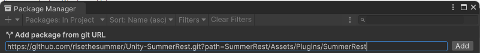
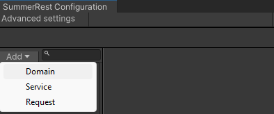

# SummerRest - HTTP Endpoints Visualization Plugin for Unity
A plugin works as Postman, which supports to visualize the structure of your HTTP endpoints and call them inside Unity

This package also generates boilerplate code based on your structure to simplify the process of calling HTTP endpoints in PlayMode

> Please note that the minimum Unity Editor version required is **2022.2** (because the project leverages UIToolkit new elements and Roslyn compiler)

## Installation
***Please do not move the plugin folder to a different position because of breaking the path constants in the plugin source***

### [Asset store]()

### [From Releases Page](https://github.com/risethesummer/Unity-SummerRest/releases)
- `SummerRest.x.y.z.unitypackage` - only necessary assets of the plugin (x.y.z is a semantic version) 
- `SummerRestSample.unitypackage` - a sample project shows simple usages of the plugin  

### Install via Git URL:
Requires a version of unity that supports path query parameter for git packages (Unity >= 2019.3.4f1, Unity >= 2020.1a21). You can add https://github.com/risethesummer/Unity-SummerRest.git?path=SummerRest/Assets/Plugins/SummerRest to Package Manager



Or add "com.summer.summer-rest": "https://github.com/risethesummer/Unity-SummerRest.git?path=SummerRest/Assets/Plugins/SummerRest" to `dependencies` section in `Packages/manifest.json`
  ```json
  {
    "dependencies": {
      "com.summer.summer-rest": "https://github.com/risethesummer/Unity-SummerRest.git?path=SummerRest/Assets/Plugins/SummerRest",
      // ... other packages
    }
  }
  ```

If you want to set a target version, please inserting a release tag x.y.z so you can specify a version on [the release page](https://github.com/risethesummer/Unity-SummerRest/releases) (unless Unity takes the last version by default). For example "com.summer.summer-rest": "https://github.com/risethesummer/Unity-SummerRest.git?path=SummerRest/Assets/Plugins/SummerRest#1.0.0"


## Definitions

There are a few important definitions in the plugin you should know to easily get acquainted with it

First and foremost, we must know the structure of an endpoint tree
- `Endpoint`: every components below are treated as `Endpoint` (technically they inherit it)
- `Domain`: This is the root component of a single backend, you may have multiple domains in your project. 
  - For example, you have a master service (my-master-service.com) and a storage service (my-storage-service.com), they possibly come up with 2 completely distinct domains and structures
    ```
    Master domain (my-master-service.com)
      User serivice
        GetUser
        PostUser
    Storage domain (my-storage-service.com)
      GetImage
      GetVideoClip
    ```
  - The main reason why we made this component is `API Versioning`: A domain has usually more than one origin (dev, prod, test...), and you have to select the active origin.
    
- `Service`: A service is nothing but an Endpoint container, it's only used to build API structure
  - A `Service` is able to have children (Service and Request)
     
- `Request`: The terminal component of an Endpoint tree (It does not have any children)
  - A `Request` is a HTTP request (yeah that's right, you need at least 1 bounding domain to call any request), that means a Request has `method` and `body`
    
- Inheriting resource path from parents stands out as the most crucial benefit of this plugin (technically string concatenation). So, the url of an element must be influenced by its parents (please note the url field of the previous captures)


Additionally, you may see these things everywhere in the plugin

-  **None, Inherit, Custom, AppendToParent**: a field marked with this attribute is able to leverage value from its **closest** parent, you may set it `None` to leave it default
   
   
   
- Raw text or custom class: sometimes the plugin allows to use custom class instead of raw text (request body, auth data)
   <br>
  - Show all types of a project is a performance killer (in spite of EditMode). So, we force you to implement predefined interfaces ([IRequestBodyData](SummerRest/Assets/Plugins/SummerRest/Runtime/RequestComponents/IRequestBodyData.cs), [IAuthData](SummerRest/Assets/Plugins/SummerRest/Runtime/RequestComponents/IAuthData.cs)) before showing your types in the dropdown
   
  - Finally, the fields are exposed and serialized thanks to [Unity Serialization](https://docs.unity3d.com/Manual/script-Serialization.html)
    ```csharp
    [Serializable] //Essential attribute to make this class work with Unity Serialization
    class MyRequestBody : IRequestBodyData
    {
        [SerializeField] private int privateFieldMustBeAnnotatedWithSerializeField; 
        // does not show up on the Inspector 
        public int NotExposedBecauseUnityDoesNotRecognizeProperty { get; set; }
        //[field: SerializeField] => the baking field is shown (but serialized name is <WrongName>K_BakingField)
        [field: SerializeField] public int WrongName { get; set; }
    }
    ```
    You may observe that "notSerializedFieldBecausePrivate" has the wrong name, and "NotExposedBecauseUnityDoesNotRecognizeProperty" is missing from the Inspector
    
      
    **Please note that, we encounter the constraints because we are using Unity Serialization. Ignore them if you plan to use your own data serializer eg. NewtonSoft, System.Text.Json...**
## Getting started

### Simple usage
- After installing the plugin, click on the `Tools/SummerRest` to open the plugin window
  
- The plugin works on an asset named **"SummerRestConfiguration"** (please do not modify it manually!), an initializing panel will be shown if the plugin does not detect the asset. You have to select a folder which contains assets belonging to the plugin <br>
  
- Initially, you need to define at least 1 domain, click on `Add` to create a new domain <br>
  
  
- A domain must have at least 1 origin, please note that origins must an absolute URL eg. https://dummyjson.com (this is a public service for testing only, please do not compromise it)
  
- Right click (or `Add` button) on an item of the domain tree view to create/delete its children
- Domain and Service are not callable, only Request offers that feature
  - Name: name of generated class associated with this endpoint [Source Generation](#source-generation)
  - Path: relative path from its parent
  - Url: absolute url formed from the parents' path and its path
- We will create a Service named Products (relative path is activity)
  
- Then, create a GET Request to get the information of product **1** (or you may directly create this Request without the previous Service (Products), but remember to fill out the relative path correctly eg. products/1)
  
- Click on `Do Request` to call your endpoint in EditMode
  
- We are tightly sticking the request to the product 1 (we need to change the path in case we refer to another product). The plugin supports `smart string` in typing the relative path of a **Request** (we consider the path of Domain and Service are stable, so currently we do not allow it)
  - You need to embed your dynamic strings inside "{}" eg. "{productId}"
  - Then a list will be shown for replacing that values in the final url
  - To continue the previous example, please change the relative path from "1" to "{productId}". Then, the final URL looks the same as the previous step
    
- You may create a searching request by using the parameters
  
- Another request which posts data, please have a look at the request body and method fields
  
- Another one downloading an image (we have created a domain named DummyJsonCdn)
  
- Please have a look at [Sample project](SummerRest/Assets/Plugins/SummerRest/Samples~/SummerRestSample) for further usages

## Auth

The guidance above is only applied for public APIs. Most of the time, you work with secured APIs that need some factors (eg. JWT, api key, username/password pair...) to authenticate and authorize your operations

### Configure
- The plugin supports to append auth information to your request
- Click on `Advanced settings` to open the auth settings section
  
- You will see a list of auth containers, each of them contains a record of key, appender type and secret value
  - `Key`: unique value of an auth container, which used by endpoints for referencing 
  - `Secret value`: the value will be only used for **EditMode requests**, and resolved by an [ISecretRepository](SummerRest/Assets/Plugins/SummerRest/Runtime/Authenticate/Repositories/ISecretRepository.cs) in PlayMode
  - `Appender type`: how the secret value will be appended into a request (typically modify the request's header), currently we support `BearerToken`, `Basic(Username/password)`,... You can make your own appender by
    - Not reusable: Manually modify params or headers of a request
    - Reusable: implement [IAuthAppender](SummerRest/Assets/Plugins/SummerRest/Runtime/Authenticate/Appenders/IAuthAppender.cs), then the class will be listed in the type dropdown
- For example: if you use `BearerTokenAuthAppender` with value "my-data", every requests refer to this container will be added with a header `"Authorization":"Bearer my-data"`  

### Secrets repository
- Storing your secrets on RAM maybe a bad idea for several reasons: 
  - Can not remember logged in sessions
  - Easy to be exploited by attackers
  - ... no idea :)
- The plugin provides a single place resolving your secrets; So a request only keeps an auth key, it needs to query a repository about the secret value

- The default repository is [PlayerPrefsSecretRepository](SummerRest/Assets/Plugins/SummerRest/Runtime/Authenticate/Repositories/PlayerPrefsSecretRepository.cs) based on [Unity PlayerPrefs](https://docs.unity3d.com/ScriptReference/PlayerPrefs.html). But you can implement your own by:
  - Inherit [ISecretRepository](SummerRest/Assets/Plugins/SummerRest/Runtime/Authenticate/Repositories/ISecretRepository.cs)
  - Modify the default repository to your class
    1. Select the default repository in the plugin window  
    2. Or change it in PlayMode by modifying `ISecretRepository.Current`

### Example

To illustrate what we have discussed on this topic so far. We're going to use a short example by calling an `GetCurrentAuthUser` api, since this endpoint requires an bearer token through a header named "Authorization"

Although this type of behaviour is supported basically [BearerTokenAuthAppender](SummerRest/Assets/Plugins/SummerRest/Runtime/Authenticate/Appenders/BearerTokenAuthAppender.cs); To make it clear, we still make a new appender by implementing [IAuthAppender](SummerRest/Assets/Plugins/SummerRest/Runtime/Authenticate/Appenders/IAuthAppender.cs)
```
// This behaves the same as what BearerTokenAuthAppender does
public class DummyJsonApiAuthAppender : IAuthAppender<DummyJsonApiAuthAppender, string>
{
    private const string AuthKeyword = "Bearer";
    public void Append<TResponse>(string data, IWebRequestAdaptor<TResponse> requestAdaptor)
    {
        // Append a header "Authorization: Bearer <my-token>"  
        requestAdaptor.SetHeader("Authorization", $"{AuthKeyword} {data}");
    }
}
```

First, we need to create a request to login (and get access token)


Then, create the respective auth container in the plugin window. Select the class you have just created as the appender and input the received token


In any Endpoint, refer to this container if you're about to authenticate the requests arisen from it


If you only call **in EditMode**, you are able to make the request up to now, because we are taking the secret value from the window. The window is useless in PlayMode; Before calling an endpoint **in PlayMode**, please make sure that current [ISecretRepository](SummerRest/Assets/Plugins/SummerRest/Runtime/Authenticate/Repositories/ISecretRepository.cs) can resolve its auth key
```csharp
// Save the secret value

// 1. This method is easiser and works with every type of data 
ISecretRepository.Current.Save("dummy-json-token", "my long token...");

// 2. If you are using the default one based on PlayerPrefs
// You can directly access PlayerPrefs yourself because they query the same source
PlayerPrefs.SetString("dummy-json-token", "my long token...");
```


If you find this way too complex, you can easily add a header to the domain, then inheriting the header in every child requests. 


## Runtime support

### Source generation

The plugin helps to leverage your structure to automatically generate corresponding source code called in PlayMode. Click `Generate source to` to initiate the process (since this process is kind of heavy, it's wise to let you run it manually)


The generated source will be structured as what you have designed in the Editor. The name of each class reflects on the name of the associated endpoint

   <br> results in
  ```csharp
  public static class MyDomain {
      public class MyRequest1 { ...
      }
      public static class MyService {
              public class MyRequest2 { ...
              }
              ...
      }
  ```
- **Because of C# limitations, we can not have an embedded class having the same name as its parent and siblings, so you must manage to avoid the collisions of endpoint names (use distinct names to easily address this problem)**
```
MyService
   MyService
public static class MyService {
  public static class MyService {} // => This causes the name collision error
}  
```
### Use generated classes
> The examples below are extracted from the [Sample project](SummerRestSample)

A class generated from `Request` comes up with some utility methods for calling the respective endpoint
- First, create a request object by invoking static `Create()` method (after a very long road :))
   ```csharp
   var request = MyDomain.MyService.MyRequest2.Create();
   ```
- Originally, the request's information (headers, params, url...) **is initially alighted with what you assigned in the Editor**
  - Technically, we copied your inputs to the generated classes
    ```csharp
    // This code only illustrates a generated request
    // The properties of this class initially copy your configures
    public PostRequest() : base("http://my-domain.com/data", "http://my-domain.com/data", IRequestModifier<AuthRequestModifier<SummerRest.Runtime.Authenticate.Appenders.BearerTokenAuthAppender, System.String>>.GetSingleton())
    {
        Method = HttpMethod.Post;
        Headers.Add(Keys.Headers.Header1, "header-value-1");
        BodyFormat = DataFormat.Json;
        InitializedSerializedBody = @"i am a big cat";
    }
    ```
  - With **text or data** request body: we keep the serialized text in the Editor 
  - With **multipart form** request: **only text rows** are copied, your file rows are only used in EditMode (but the file keys are still generated)
- But you can modify them through the object's properties (The auth key is modifiable but the appender is not). Please note that, a request object is reusable, you can keep it as a field in your classes
  ```csharp
  // Allias to the long name
  using Request2 = MyDomain.MyService.MyRequest2;
  public class MyBehaviour : MonoBehaviour
  {
     private Request2 _myRequest;
     private void CreateRequest() {
        _myRequest = Request2.Create();
        // Instead of typing the keys yourself, you should access Keys class for getting predefined strings
        // Request2.Keys.Headers.RunTimeHeader results in "run-time-header"
        _myRequest.Headers.Add(Request2.Keys.Headers.RunTimeHeader, "run-time-value");
        // Request2.Keys.Headers.UrlFormat.ProductId results in "product-id"
        _myRequest.SetUrlValue(Request2.Keys.Headers.UrlFormat.ProductId, "my-product");
        // Request2.Keys.Params.Search results in "search"
        _myRequest.Params.SetSingleParam(Request2.Keys.Params.Search, "player has just typed something");
     }
  }

  ```
- The plugin supports 3 types of request: data, texture, audio clip. Each of them has 2 versions: Simple (only return response body) and Detailed
   ```csharp
    ... // Continue from the last example
    using Request2 = MyDomain.MyService.MyRequest2;
    public class MyResponseData
    {
        public string Name { get; set; }
        public int Age { get; set; }
    }
    public class MyBehaviour : MonoBehaviour
    {
        private Request2 _myRequest;
        private void DoRequest()
        {
            // Request normal data
            StartCoroutine(_myRequest.DataRequestCoroutine<MyResponseData>(HandleResponse, HandleError));
            // Request texture
            StartCoroutine(_myRequest.TextureRequestCoroutine(HandleResponseTexture, true));
            // Request audio clip
            StartCoroutine(_myRequest.AudioRequestCoroutine(HandleResponseAudioClip, AudioType.WAV));
        }
        private void HandleResponse(MyResponseData responseData) { ... }
        private void HandleResponseTexture(Texture2D texture) { ... }
        private void HandleResponseAudioClip(AudioClip audioClip) { ... }
        // OnError is optional
        private void HandleError(ResponseError error) { ... }
    }
   ```
- The simple methods only provide you with the response body, in case you want to delve into the response. You should consider leveraging detailed methods
  ```csharp
  private void DoDetailedRequest()
  {
      // Request normal data
      StartCoroutine(_myRequest.DetailedRequestCoroutine<MyResponseData>(HandleDetailedResponse));
      // Request audioClip/texture is similar to the previous step 
      ...
  }
  private void HandleDetailedResponse(WebResponse<MyResponseData> responseData)
  {
      Debug.Log(responseData.StatusCode);
      Debug.Log(responseData.RawData);
      Debug.Log(responseData.Data);
      ...
  }
  ```
- In case you need to make an undefined request (eg. an image url). You would rather use [WebRequestUtility](SummerRest/Assets/Plugins/SummerRest/Runtime/RequestAdaptor/WebRequestUtility.cs)
  ```csharp
  public void GetImageByAbsoluteUrl(string url)
  {
      StartCoroutine(WebRequestUtility.TextureRequestCoroutine(
          url: url, nonReadable: false, doneCallback: ShowImage, 
          // Use a builder to modify the request
          adaptorBuilder: b =>
          {
              // Change request data if neccessary
              b.RedirectLimit = 3;
              b.SetHeader("my-header", "my-value");
          }));
  }
  private void ShowImage(Texture2D text) { ... }
  ```
- Please have a look at [Sample project](SummerRestSample) for complete examples
### Async
- Normally, generated classes only have coroutine methods. 
- You can enable async methods by add **"SUMMER_REST_TASK"** [Scripting Define Symbol](https://docs.unity3d.com/Manual/CustomScriptingSymbols.html) and import [UniTask](https://github.com/Cysharp/UniTask) package. Async methods are highly recommended because of simplicity
  
- Please note that the async methods will throw exceptions on error instead of callbacks
  ```
  private async UniTaskVoid GetProductDataAsync(int productId)
  {
      var getProduct = GetProduct.Create();
      // Simple response
      try
      {
          var product = await getProduct.DataRequestAsync<Product>();
          Debug.LogFormat("My product {0}", product);
      }
      catch (ResponseErrorException responseErrorException)
      {
          //Undefined exception
          Debug.Log("Network error {0}", responseErrorException.Error);
      }
      catch (Exception e)
      {
          //Undefined exception
          Debug.LogException(e);
      }
  }
  ```
### Advanced settings

The plugin provides a most common way to deal with HTTP requests. But, you are able to embed your customizations easily 

- Data serializer: the [default serializer](SummerRest/Assets/Plugins/SummerRest/Runtime/Parsers/DefaultDataSerializer.cs) bases on [JsonUtility](https://docs.unity3d.com/ScriptReference/JsonUtility.html), you can adapt it through the plugin window (Advanced settings section) or `IDataSerializer.Current` 
- ISecretRepository: the default repository bases on [Unity PlayerPrefs](https://docs.unity3d.com/ScriptReference/PlayerPrefs.html), you can adapt it through the plugin window (Advanced settings section) or `ISecretRepository.Current`
- There are some more considerations like [IContentTypeParser](SummerRest/Assets/Plugins/SummerRest/Runtime/Parsers/IContentTypeParser.cs), [IUrlBuilder](SummerRest/Assets/Plugins/SummerRest/Runtime/Parsers/IUrlBuilder.cs)... we do not offer default selections for them in the window because we suppose there is no need to change their logic

## Acknowledgments

We would like to express our sincere gratitude to the following dependencies

- [DummyJson](https://dummyjson.com/): provides different types of REST Endpoints filled with JSON data
- [UniTask](https://github.com/Cysharp/UniTask): provides an efficient async/await integration to Unity

We extend our thanks to the developers and maintainers of these dependencies for their outstanding work and contribution to the open-source community.
