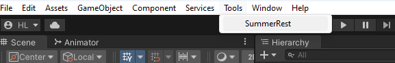
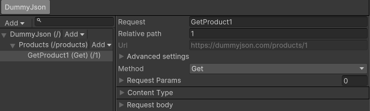
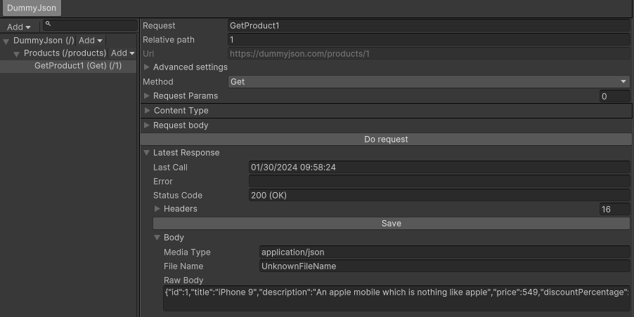

# SummerRest - HTTP Endpoints Visualization Plugin for Unity
A plugin works as Postman, which supports to visualize the structure of your HTTP endpoints and request them inside Unity

This package also generates boilerplate code based on your structure to simplify the process of calling HTTP endpoints in Runtime mode


## Installation
***Please do not move the plugin folder to a different position because the plugin embeds UXML files inside custom property drawers (change the path will break the path constants in source)***

### Asset store

### Git

## Definitions

There are a few important definitions in the plugin you should know to easily get acquainted with it

First and foremost, we must know the structure of an endpoint tree
- `Endpoint`: every components below are treated as `Endpoint` (actually they inherit it :))
- `Domain`: This is the root component of a single backend, you may have multiple domains in your project. 
  - For example, you have a master service (my-master-service.com) and a storage service (my-storage-service.com), it possibly comes up with 2 different domains because they have completely distinct structures
    ```
    Master domain (my-master-service.com)
      User serivice
        GetUser
        PostUser
    Storage domain (my-storage-service.com)
      GetImage
      GetVideoClip
    ```
  - The main reason why I made this component is `API Versioning`: A domain has usually more than one origin (dev, prod, test...), and you have to select the active origin.
    
- `Service`: A service is nothing but an Endpoint container, it's only used to build API structure
  - A `Service` is able to have children (Service and Request)
     
- `Request`: The terminal component of an Endpoint tree (It does not have any children)
  - A `Request` is a HTTP request (yeah that's right, you need at least 1 bounding domain to call any request), that means a Request has `method` and `body`
    
- Inheriting resource path from parents stands out as the most crucial reason of this plugin (technically, string concatenations). So, the url of an element must be influenced by its parents (please note the url field of the previous captures)


Additionally, you may see these things everywhere in the plugin

-  **None, Inherit, Custom, AppendToParent**: a field marked with this attribute is able to leverage value from its **closest** parent, you may set it `None` to leave it default
   
   
   
- Raw text or custom class: sometimes the plugin allows to use custom class instead of raw text (request body, auth data)
   <br>
  - Show all of types in the project is a performance killer (in spite of Editor time). So, we force you to implement predefined interfaces ([IRequestBodyData](SummerRest/Assets/Plugins/SummerRest/Runtime/RequestComponents/IRequestBodyData.cs), [IAuthData](SummerRest/Assets/Plugins/SummerRest/Runtime/RequestComponents/IAuthData.cs)) before showing your types in the dropdown
   
  - Finally, the fields are exposed thank to [Unity Serialization](https://docs.unity3d.com/Manual/script-Serialization.html)
    ```csharp
    [Serializable] //Essential attribute to make this class work with Unity Serialization
    class MyRequestBody : IRequestBodyData
    {
        [SerializeField] private int privateFieldMustBeAnnotatedWithSerializeField; 
        // does not show up on the Inspector 
        public int NotExposedBecauseUnityDoesNotRecognizeProperty { get; set; }
        //[field: SerializeField] => the baking field is shown (but serialized name is <WrongName>K_BakingField)
        [field: SerializeField] public int WrongName { get; set; }
    }
    ```
    You may observe that "notSerializedFieldBecausePrivate" has the wrong name, and "NotExposedBecauseUnityDoesNotRecognizeProperty" is missing from the Inspector
    
      
    **Please note that, we encounter the constraints because we are using Newtonsoft and Unity Serialization concurrently. Ignore them if you plan to use your own data serializer (and needn't show custom classes on the Inspector)**
## Getting started

- After installing the plugin, click on the `Tools/SummerRest` to open the plugin window
  
- The plugin works on an asset named **"SummerRestConfiguration"** (please do not modify it manually!), an initializing panel will be shown if the plugin does not detect the asset. You have to select a folder which contains assets belonging to the plugin <br>
  
- Initially, you need to define at least 1 domain, click on `Add` to create a new domain <br>
  
  
- A domain must have at least 1 origin, please note that origins must an absolute URL eg. https://www.boredapi.com/api (this is a public service for testing only, please do not compromise it)
  
- Right click (or `Add` button) on an item of the domain tree view to create/delete its children
- Domain and Service are not callable, only Request offers that feature
  - Name: name of generated class associated with this endpoint [Source Generation]()
  - Path: relative path from its parent
  - Url: absolute url formed from the parents' path and its path
- We will create a Service named Activity (relative path is activity)
  
- Then, create a GET Request (or you may directly create this Request without the previous Service, but remember to fill out the relative path correctly!)
  
- Click on `Do Request` to call your endpoint in the editor
  

## Auth

### Configure
- The plugin supports to append auth information to your request
- Click on `Advanced settings` to open the auth settings section
  
- You will see a list of auth containers, each of them contains a record of key, appender type and auth data
  - Key: used by endpoints to refer the auth container
  - Auth data: the value will be only used for editor requests, this value will be resolved by an [IAuthDataRepository](SummerRest/Assets/Plugins/SummerRest/Runtime/Authenticate/TokenRepositories/IAuthDataRepository.cs) in runtime
  - Appender type: how the auth data will be appended into a request (typically modify the request's header), currently we support BearerToken, Basic(Username/password),... You can make your own appender by
    - Modify params or headers of an endpoint (not reusable)
    - Or implement [IAuthAppender](SummerRest/Assets/Plugins/SummerRest/Runtime/Authenticate/Appenders/IAuthAppender.cs), then the class will be listed in the type dropdown
- For example: if you use BearerToken with data "my-data", every requests refer to this container will be added a header "Authorization":"Bearer my-data"  

### Auth data repository
- Storing your secrets on RAM maybe a bad idea for several reasons: 
  - Can not remember logged in sessions
  - Easy to be exploited by attackers
  - ... I don't know
- The plugin provides a single place resolving your auth data; So a request only keeps auth key and appender type, it needs to query a repository about the auth data  
- The default repository bases on PlayerPrefs. But you can implement your own
  - Inherit [IAuthDataRepository](SummerRest/Assets/Plugins/SummerRest/Runtime/Authenticate/TokenRepositories/IAuthDataRepository.cs)
  - Select the default repository in the plugin window  
  - Or change it in runtime by modifying `IAuthDataRepository.Current`

### Example

To illustrate what I speak on this session so far. I am using a short example by calling an RandomWordApi of https://api-ninjas.com, since this endpoint requires an Api key through a header named "X-Api-Key"

Because this type of behaviour is not supported basically. I make my own appender by implementing [IAuthAppender](SummerRest/Assets/Plugins/SummerRest/Runtime/Authenticate/Appenders/IAuthAppender.cs)
```
public class NinjaApiAuthAppender : IAuthAppender<NinjaApiAuthAppender>
{
    public void Append<TResponse>(string authDataKey, IWebRequestAdaptor<TResponse> requestAdaptor)
    {
        //Get auth token 
        var token = IAuthDataRepository.Current.Get<string>(authDataKey);
        //Append it into the request's header
        requestAdaptor.SetHeader("X-Api-Key", token);
    }
}
```

Then, create the respective auth container in the plugin window. Select the class you have just created as the appender


In any Endpoint, refer to this container if you're about to authenticate requests arisen from it


If you only call in Editor mode, it's fine because we are taking the auth value from the window. The window is useless in runtime; Before calling an endpoint, please make sure that current [IAuthDataRepository](SummerRest/Assets/Plugins/SummerRest/Runtime/Authenticate/TokenRepositories/IAuthDataRepository.cs) can resolve its auth key
```
// This method is easiser and works with every type of data 
IAuthDataRepository.Current.Save("ninja-api-token", "my token is...");

// If you are using the default one based on PlayerPrefs
// You can directly access PlayerPrefs yourself because they query the same source
PlayerPrefs.SetString("ninja-api-token", "my token is...");
```


If you find this way too complex, you can easily add a header to the domain, then inheriting the header in every child requests. 


## Runtime support

### Source generation

The plugin helps to leverage your structure to automatically generate corresponding source code called in runtime. Click `Generate source to` to initiate the process


The generated source will be structured as what you have designed in Editor. The name of each class reflects on the name of the associated endpoint

   <br> results in
  ```csharp
  public static class MyDomain {
      public class MyRequest1 { ...
      }
      public static class MyService {
              public class MyRequest2 { ...
              }
              ...
      }
  ```
- **Because of C# limitations, we can not have an embedded class having the same name as its parent and siblings, so you must manage to avoid the collisions of endpoint names (use distinct names to easily address this problem)**
```
MyService
   MyService
public static class MyService {
  public static class MyService {} // => This causes the name collision error
}  
```
### Use generated classes
A class generated from `Request` comes up with some utility methods for calling the respective endpoint
- First, create a request object by invoking static `Create()` method (after a very long road :))
   ```csharp
   var request = MyDomain.MyService.MyRequest2.Create();
   ```
- Originally, the request's information (headers, params, url...) is alighted with what you assigned in Editor
- But you can modify them through the object's properties (The auth key is modifiable but the appender is not). Please note that, a request object is reusable, you can keep it as a field in your classes
  ```csharp
  // Allias to the long name
  using Request2 = MyDomain.MyService.MyRequest2;
  public class MyBehaviour : MonoBehaviour
  {
     private Request2 _myRequest;
     private void CreateRequest() {
        _myRequest = Request2.Create();
        _myRequest.Headers.Add("run-time-header", "run-time-value");
        _myRequest.Params.AddParam("search-keyword", "player has just typed something");
     }
  }

  ```
- The plugin supports 3 types of request: data, texture, audio clip. Each of them has 2 versions: Simple (only return response body) and Detailed
   ```csharp
    ... // Continue from the last example
    using Request2 = MyDomain.MyService.MyRequest2;
    public class MyResponseData
    {
        public string Name { get; set; }
        public int Age { get; set; }
    }
    public class MyBehaviour : MonoBehaviour
    {
        private Request2 _myRequest;
        private void DoRequest()
        {
            // Request normal data
            StartCoroutine(_myRequest.RequestCoroutine<MyResponseData>(HandleResponse, HandleError));
            // Request texture
            StartCoroutine(_myRequest.TextureRequestCoroutine(HandleResponseTexture, true));
            // Request audio clip
            StartCoroutine(_myRequest.AudioRequestCoroutine(HandleResponseAudioClip, AudioType.WAV));
        }
        private void HandleResponse(MyResponseData responseData) { ... }
        private void HandleResponseTexture(Texture2D texture) { ... }
        private void HandleResponseAudioClip(AudioClip audioClip) { ... }
        // OnError is optional, you should consider detailed calls when encountering complex errors
        private void HandleError(string error) { ... }
    }
   ```
- The simple methods only provide you with the response body, in case you want to delve into the response. You should consider leveraging detailed methods
  ```
  private void DoDetailedRequest()
  {
      // Request normal data
      StartCoroutine(_myRequest.DetailedRequestCoroutine<MyResponseData>(HandleDetailedResponse));
      
      // Request audioClip/texture is similar to the previous step 
  }
  private void HandleDetailedResponse(WebResponse<MyResponseData> responseData)
  {
      Debug.Log(responseData.StatusCode);
      Debug.Log(responseData.RawData);
      Debug.Log(responseData.Data);
      ...
  }
  ```

### Async
- Normally, generated classes only have coroutine methods. 
- You can enable async methods by add **"SUMMER_REST_TASK"** [Scripting Define Symbol](https://docs.unity3d.com/Manual/CustomScriptingSymbols.html) and import [UniTask](https://github.com/Cysharp/UniTask) package. Async methods are highly recommended because of simplicity
- Please note that the simple async methods will throw exceptions on error  
```
public class User
{
    public string UserId { get; set; }
}
// Assume that UserDataRequest, TextureRequest are generated classes based on your configures in the plugin window
private UserDataRequest _userRequest;
private TextureRequest _imageRequest;
private async UniTask LoadUserData()
{
    var userData = await _userRequest.RequestAsync<User>();
    _imageRequest.Params.AddParam("user-id", userData.UserId);
    var userIcon = await _imageRequest.TextureRequestAsync();
}
```
### Advanced settings

The plugin provides a most common way to deal with HTTP requests. But, you are able to embed your customizations easily 

- Data serializer: the [default serializer](SummerRest/Assets/Plugins/SummerRest/Runtime/Parsers/DefaultDataSerializer.cs) bases on [NewtonSoft package](https://docs.unity3d.com/Packages/com.unity.nuget.newtonsoft-json@3.0/manual/index.html), you can adapt it through the plugin window (Advanced settings section) or `IDataSerializer.Current` 
- IAuthDataRepository: the default repository bases on [Unity PlayerPrefs](https://docs.unity3d.com/ScriptReference/PlayerPrefs.html), you can adapt it through the plugin window (Advanced settings section) or `IAuthDataRespoitory.Current`
- There are some more considerations like [IContentTypeParser](SummerRest/Assets/Plugins/SummerRest/Runtime/Parsers/IContentTypeParser.cs), [IUrlBuilder](SummerRest/Assets/Plugins/SummerRest/Runtime/Parsers/IUrlBuilder.cs)... I do not offer default selections for them in the window because I think there is no need to change their logic